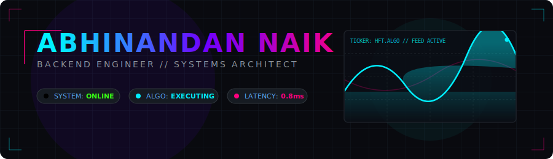

  <!-- Cyberpunk Animated HUD Header Banner -->
  

 

<table align="center" style="border: none; border-collapse: collapse; width: 100%;">
  <tr>
    <td width="55%" align="left" style="border: none; padding-right: 20px; vertical-align: top;">
      <h3>📡 Operations Telemetry</h3>
      <ul>
        <li>🔭 <b>Active Node:</b> Engineering high-frequency algorithmic trading systems to maximize latency efficiency.</li>
        <li>🌱 <b>Core Focus:</b> Spring Boot microservices, cloud-native deployments, and event-driven data piping.</li>
        <li>🏗️ <b>Mission Control:</b> Developing <b>TrackWise</b>, a unified telemetry monitoring solution for microservice fabrics.</li>
        <li>🎯 <b>Vector 2026:</b> Engineering clean, scalable, and fail-safe system fabrics.</li>
      </ul>
    </td>
    <td width="45%" align="center" style="border: none; vertical-align: middle;">
      
    </td>
  </tr>
</table>

 

<h3 align="center">🔮 Skill Topology</h3>

  
<i>System infrastructure connections mapping my technology stack.</i>

  

 

<h3 align="center">📊 Telemetry Dashboard</h3>

  
<i>Live telemetry logs and GitHub statistics compiled dynamically.</i>

  

 
<h3 align="center">🏙️ Contribution Matrix</h3>

  
<i>Holographic grid recording system contributions and repository modification cycles.</i>

  

 

  <!-- High-tech badges for contact and socials -->
  
  

 

  <code>[ TERMINAL SESSION TERMINATED // SECURE OUTBOUND CONNECTION ]</code>

